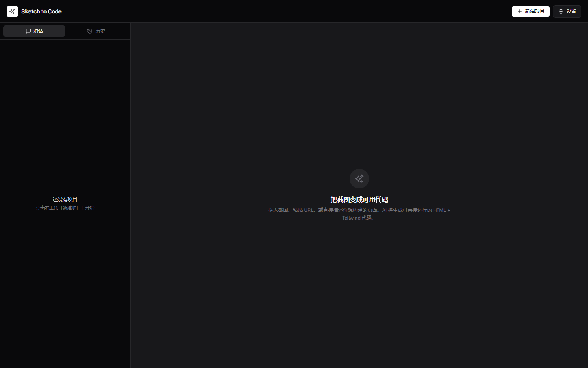
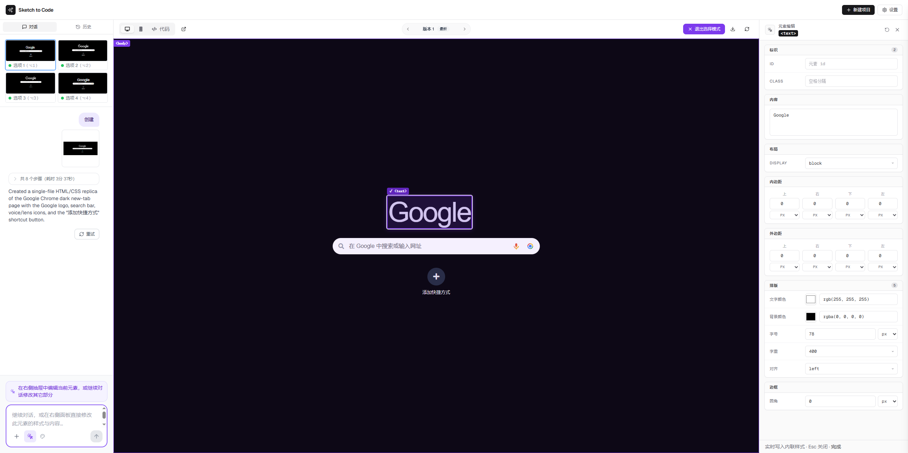
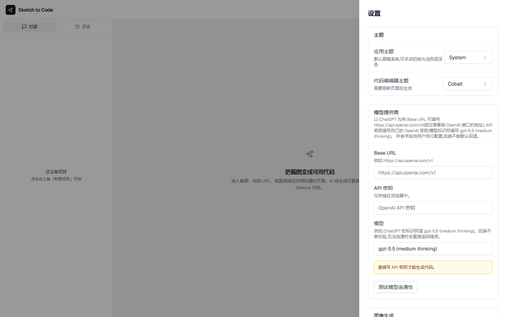
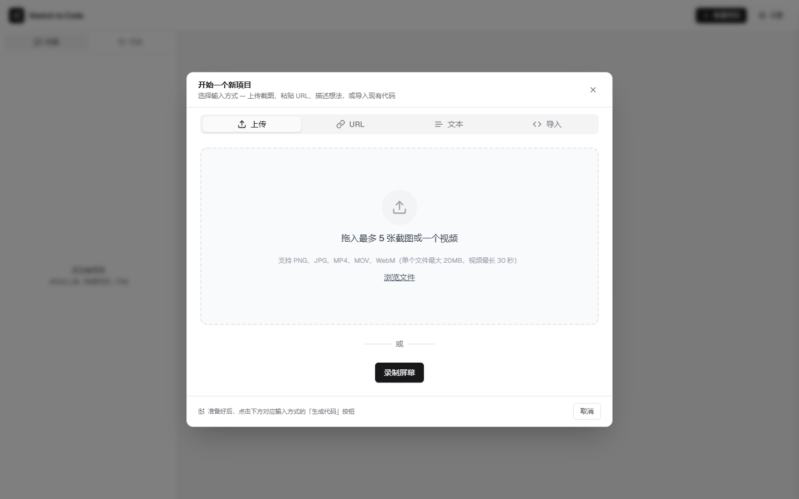
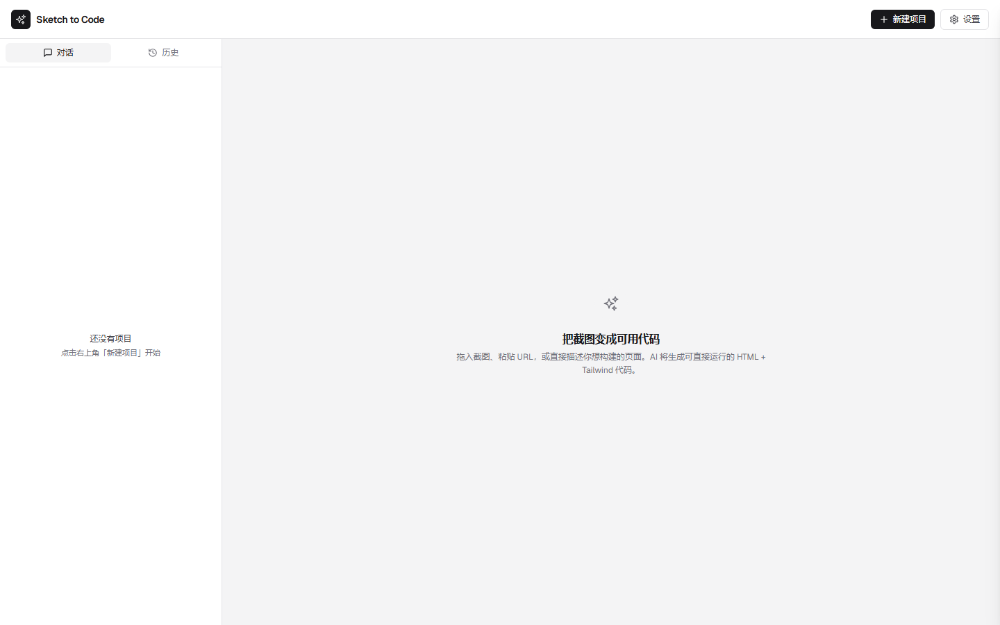

# Sketch-to-Code

> 面向开发者的设计稿转代码工具。把截图、手绘稿、Figma、网页录屏变成可运行的 HTML / React / Vue 代码 —— 全部在本地浏览器完成，模型密钥你自己掌控。



## 为什么是它

| 你想要的 | 这里给你的 |
| --- | --- |
| 想接自己的 OpenAI 兼容代理、Anthropic、Gemini、Kimi | 一个下拉框 + Base URL + API Key + 模型标识符，无任何硬编码默认值 |
| 改个 padding / 字号不想再花一次 AI token | 点选预览中的元素，左侧检查器直接改 inline style，实时写入代码 |
| 想在 375px 视口检查移动端布局 | 顶部一键切换桌面 / 移动，不丢失滚动条与交互 |
| 录一段网页交互就想生成动效原型 | 录屏 → 解析关键帧 → 多帧合并生成 |
| UI 自己看着顺眼 | 黑白 zinc mono 主题 + Geist / Geist Mono 字体，无品牌色霸屏 |

## 与上游的关系

本项目基于 [abi/screenshot-to-code](https://github.com/abi/screenshot-to-code) (MIT)，遵循原协议继续开源。我们补全了企业级可用性细节、把默认配置清零，并把 inspector 流程做到类 DevTools 的体验。

```
Copyright (c) 2023 Abi Raja
Copyright (c) 2026 koda
```

详见 [LICENSE](./LICENSE)。

## 核心能力

### 1. 点选即改的元素检查器



不需要再次发起 AI 调用。点选预览里任意元素，右侧浮出检查器面板：

- 标识：`id` / `class`
- 内容：文本（textarea）、`placeholder`（仅在元素已声明时出现）、图片元素隐藏
- 布局：`display`
- 间距：四方向 `padding` / `margin`，每条独立单位（`px` / `rem` / `em` / `%` / `vw` / `vh`）
- 排版：文字颜色、背景颜色、字号、字重、对齐方式
- 边框：圆角

每次字段变更都会序列化回当前 commit 的源代码，下次刷新不会丢。`Esc` 退出选择模式，↺ 一键还原所有修改。

### 2. 自定义 Provider，不绑死任何供应商



设置面板里把 OpenAI / Anthropic / Gemini / Kimi 合并成一张卡：

- **Base URL**：留空走官方，可填任何 OpenAI 兼容代理
- **API Key**：仅存浏览器本地（`type=password`）
- **模型标识符**：自由填写，例如 `gpt-5.5 (medium thinking)` / `claude-opus-4-6` / `gemini-3.1-pro-preview` / `kimi-k2-0711-preview`

`测试模型连通性` 按钮会立即向 `/api/test-model-connection` 发起请求，告诉你是 401 / 404 / 网络错误还是真的通了。

后端不会回退到任何环境变量 —— 你填什么就跑什么。

### 3. 国产大模型深度适配

OpenAI / Anthropic / Gemini 之外，**Kimi（Moonshot）是一等公民** —— 不是简单走 OpenAI 兼容层，而是独立 Provider 实现：

| 适配点 | 做了什么 |
| --- | --- |
| 专用 Provider | [`backend/agent/providers/kimi.py`](backend/agent/providers/kimi.py) 单独跑 `api.kimi.com/coding` 端点 |
| 参数约束 | 该端点只接受 `temperature=1`（其它值会被服务端拒绝），请求体里硬编码锁死 |
| 流式解析 | Kimi 的 tool-call delta 与 OpenAI 略有差异，独立 streaming parser 负责重组 |
| tool envelope | 显式拼装 `{"type":"function","function":{...}}` 嵌套结构，不丢字段 |
| 模型枚举 | `Llm.KIMI_FOR_CODING = "kimi-for-coding"` 单独标识，路由不与其他 Kimi 模型串台 |
| 中文 UI | 设置面板、错误提示、占位符、模型示例、API 文档全链路中文 |

不只是 Kimi —— DeepSeek / Qwen / GLM / 文心 / 智谱 等国产模型只要提供 OpenAI 兼容接口，**填到 Base URL + API Key + 模型标识符就能跑**，后端不做任何特殊处理。

切换模型时工具调用语法、流式增量、function envelope 这些是真正磨时间的地方；针对国产模型的端点约束已经在 Provider 层处理过一遍。

### 4. 录屏转代码



录一段网页交互，自动切帧送进模型，生成对应动效的原型。
（视频模式当前仅支持 HTML + Tailwind 输出。）

### 5. Mono UI 主题



所有页面统一锌色 + 黑白反转的强调色，无 violet / green 抢眼。
代码字体用 Geist Mono，匹配代码编辑器风格。

## 支持的输出栈

- HTML + Tailwind
- HTML + CSS
- React + Tailwind
- Vue + Tailwind
- Bootstrap
- Ionic + Tailwind

## 内置模型

- **OpenAI** — GPT-5.5, GPT-5.4 Mini
- **Anthropic** — Claude Opus 4.8, Claude Opus 4.6, Claude Sonnet 4.6
- **Gemini** — 3.1 Pro Preview, 3 Flash Preview
- **Kimi / Moonshot** — `kimi-for-coding`（专用 Provider，见上文 §3）
- **Replicate** — z-image-turbo（图片生成 / 编辑 / 抠图）

实际可用模型取决于你在设置面板填写的 `模型标识符` —— DeepSeek / Qwen / GLM / 文心 等 OpenAI 兼容的国产模型同样可以填进来用。

## 🛠 本地运行

需要至少一个 Provider 的密钥（OpenAI / Anthropic / Gemini / Kimi 任一）。
再加 Replicate 密钥可解锁图片生成与编辑能力。

```bash
git clone <repo-url> sketch-to-code
cd sketch-to-code
```

### 启动后端

```bash
cd backend
echo "OPENAI_API_KEY=sk-your-key"     > .env
echo "ANTHROPIC_API_KEY=your-key"    >> .env
echo "GEMINI_API_KEY=your-key"       >> .env
echo "REPLICATE_API_KEY=r8_your-key" >> .env  # 可选，但强烈建议

poetry install
poetry run playwright install chromium
poetry run uvicorn main:app --reload --port 7001
```

> **截图预览（可选）** —— 让 agent 用无头浏览器渲染自己刚生成的页面并目检布局。
> 装了 Chromium 后自动启用；设置面板里会显示当前是否可用。

### 启动前端

```bash
cd frontend
pnpm install
pnpm dev
```

打开 http://localhost:5173 即可使用。

如果改了后端端口，在 `frontend/.env.local` 里调整 `VITE_WS_BACKEND_URL` 和 `VITE_HTTP_BACKEND_URL`。

## Docker

```bash
echo "OPENAI_API_KEY=sk-your-key" > .env
docker-compose up -d --build
```

默认开在 http://localhost:5173。注意：容器里改源码不会触发重建，仅适合跑生产或预览。

## 仓库结构

```
.
├── backend/          FastAPI 服务
│   ├── agent/        多帧合成、视频模式 agent
│   ├── codegen/      按 stack 区分的代码生成策略
│   ├── evals/        评测脚本与数据集
│   ├── llm.py        多 Provider LLM 适配层
│   ├── main.py       FastAPI 入口
│   ├── prompts/      各场景 prompt 模板
│   └── routes/       HTTP / WebSocket 路由
├── frontend/         Vite + React + Tailwind
│   ├── src/
│   │   ├── components/preview/         预览 iframe + 代码面板
│   │   ├── components/select-and-edit/ 元素检查器与选择模式
│   │   ├── components/settings/        Provider / 模型设置
│   │   ├── components/unified-input/   截图 / 文本 / URL / 录屏输入
│   │   └── store/                      Zustand 状态
│   └── package.json
├── docker-compose.yml
├── LICENSE
└── README.md
```

## 路线图

- [ ] 元素检查器：box-shadow / border / 渐变 / 动画时长
- [ ] 多选元素 + 批量改样式
- [ ] 检查器里撤销 / 重做栈
- [ ] Tailwind class 智能建议（不改 inline style）
- [ ] 自托管 Provider (Ollama / vLLM) 一等支持

## 常见问题

- **后端启动报错？** 看 [Troubleshooting.md](./Troubleshooting.md)。
- **怎么换 OpenAI 代理？** 设置面板里改 Base URL，或在 `backend/.env` 里加 `OPENAI_BASE_URL=https://your-proxy/v1`。
- **怎么反馈？** 直接提 issue。

## 致谢

本项目得以成立，因为站在一位慷慨的作者肩上：

- **[Abi Raja](https://github.com/abi) / [screenshot-to-code](https://github.com/abi/screenshot-to-code)** — 原作者。完整的多模态代码生成 pipeline、所有 prompt 模板、agent 状态机、multi-frame 视频合成逻辑、流式事件协议、evals 评测框架、provider 抽象层 —— 全部源自这份 MIT 开源工作。本项目在原协议下继续分发，沿用相同的核心架构。
- 字体：[Geist](https://vercel.com/font) + Geist Mono。
- UI 组件：[shadcn/ui](https://ui.shadcn.com/) 风格的 Radix 封装。

## 许可

MIT — 见 [LICENSE](./LICENSE)。